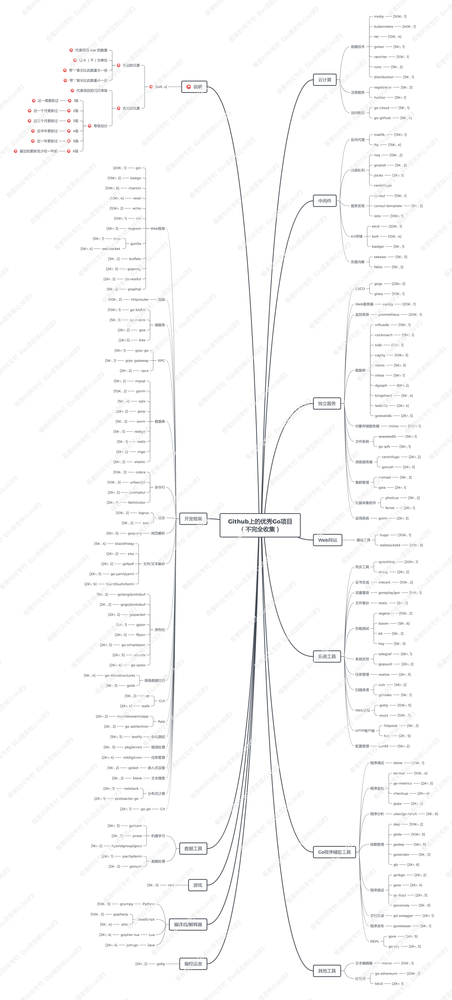

# 导读 | 学习专栏的正确姿势
你好，我是郝林，今天我分享的主题是，学习专栏的正确姿势。

到了这里，专栏的全部内容已经都推送到你的面前了。如果你已经同步学习完了，那么我要给你点一个大大的赞！

还没有看完的同学也不要着急，因为推送的速度肯定要比你们的学习速度快上不少。如果是我的话，我肯定无法用很快的速度，去认真地学习和理解专栏内容的。不过，粗读一遍的话，这个时间倒是绰绰有余的。我今天就想跟你聊聊学习专栏的正确姿势。

## 专栏应该怎样学

我们做互联网技术的人，应该对这种索引+摘要+详情的数据存取方案并不陌生。我希望我的专栏文章也可以达成这样的一种状态：它是你需要时，即能查阅的知识手册。

在第一次听音频或浏览文章的时候，你可以走马观花，并不用去细扣每一个概念和每一句话。让自己对每一个主题、每一个问题和每一个要点都有一个大概的印象就可以了。

如此一来，当想到或遇到某方面的疑惑的时候，你就可以有一个大致的方向，并且知道怎样从专栏里找出相应的内容。

这就是所谓的粗读，相当于在你的脑袋里面存了一份索引，甚至是一份摘要。利用这种快速的学习方式，你往往可以在有限的精力和无限的知识之间做出适合你的权衡。

极客时间可以让我们无限期地查阅专栏的全部内容。所以你完全不用心急，可以按照自己的节奏先粗读、再细读，然后再拿这个专栏当做知识手册来用。重要的是真正的理解和积极的实践，而不是阅读的速度。

## 实践的正确姿势

最近一段时间，有不少同学问我说：“老师，我快要学完这个专栏了，也买了你的书，那我后边怎么去实践呢？”

问我此类问题的同学，大多数都是很少有机会在工作中使用Go语言的程序员，或者是对Go语言感兴趣的互联网领域的从业者，还有一些是在校的大学生。

我给大家的第一个建议一般都是“去写网络爬虫吧”。

互联网络的世界很庞杂，但又有一定的规律可循，是非常好的技术学习环境。你编写一个网络服务程序，即使放到了公共的网络上，也还需要考虑清楚一系列的问题，才能让你有足够多的技术磨炼机会，比如，服务的种类、功能、规则、安全、界面、受众、宣传和访问途径，以及日常的非技术性维护。

我认为，这已经不是纯粹的技术实践了，对于初期的技术技能增长是不利的。当然了，如果你有信心和精力去搞定这一系列问题，并乐于从中学习到各种各样的技能，那就放手去做吧。

我在我的书和专栏中一直都在释放这样几个信号：“并发程序”“互联网络”“客户端”“网络爬虫”。这其实就是我们实践的最佳切入点。它成本低，收效明显，既有深度又有广度。

有的同学还问我：“我的程序爬取了某某网站，可是只爬了两三下就好像被人家封掉了”。原因很明显，你暴力获取人家的网站内容，肯定会封你的啊。

我们要让程序去模拟人的行为，模拟人使用网络浏览器访问网站内容的过程，而不是用尽计算力去疯狂地霸占人家的带宽和服务，否则那不就成了网络攻击了。这是一个非常重要的自我实践的技巧，请大家记住，“利己，但不要损人”。

注意，正常爬取网站内容并不意味着失去了高并发的应用场景。把内容下载下来只是一个开始，后边还有不少的工作要做呢。

单单“模拟人”这一点就需要花一些心思。而且，你可以同时爬取成千上万的同类甚至不同类的网站。这已经足够你研究和实践很长一段时间了。我在这里还要郑重地提示一下，做这类技术研究一定不要跨越道德的底线，更不能违反法律。

再进一步，我们最好以结构化的形式把爬取到的网络内容存储下来。当得到足够多的数据之后，你的选择就很多了。比如，对某类数据进行整理、提取和分析，从而挖掘出更有价值的东西。这就属于数据挖掘的范畴了。

在如今这个数据过剩的时代，这也是一项很重要的技能。又比如，基于这些数据提供统一的访问接口，制作成搜索引擎，甚至对外提供服务。这也是一个很有深度的选择。

当然，技术实践的方式远不止这些。不过鉴于篇幅，我就先说这么多。

## 优秀Go项目推荐

最后，我再给大家推荐一些优秀的Go项目。别忘了，阅读优秀的项目源码也是一个很重要的学习途径。请看下图。

（长按保存大图查看）

这幅图包含了我之前私藏的所有高 `Star`，且近期依然活跃的Go项目。不得不说，在Github这个全球最大的程序员交友社区中，好东西真的是不少。

在这幅图的左上角，有我对图中各种符号的说明，大家在进一步读图之前需要先看一下。参看这些项目的顺序完全由你自己决定，不过我建议从“贴近你实际工作的那个方面”入手，然后可以是“你感兴趣的方面”，最后有机会再看其他的项目。千万不要贪多，要循序渐进着来。

[戳此查看Go语言专栏文章配套详细代码。](https://github.com/hyper0x/Golang_Puzzlers)